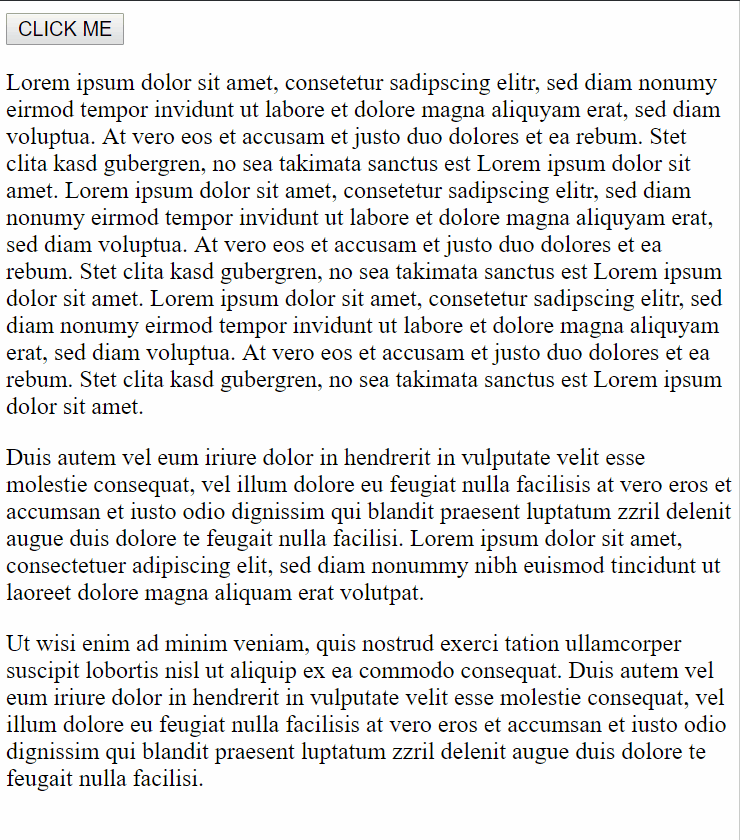

# complex-spinner
A plain html / css spinner representing our organisation logo

## Usage
- include css from `clx_spinner.css`
- place following markup in your page when spinner should be shown: `<div class="clx_curtain"><div class="clx_spinner"></div></div>`
- Alternatively: load `clx_spinner.js` and add a CustomElement `<clx-spinner></clx-spinner>` to your markup when spinner has to be shown.

## Example
Here is an example for creating the CustomElement with additional "size" parameter.
```
document.getElementById('clickMe').addEventListener('click', function(ev) {
  var spinner = document.createElement("clx-spinner");
  
  // add data-size for dynamic size given from callsite
  spinner.dataset.size = '100px';
    document.querySelector('body').appendChild(spinner);
});
```

## Demo

